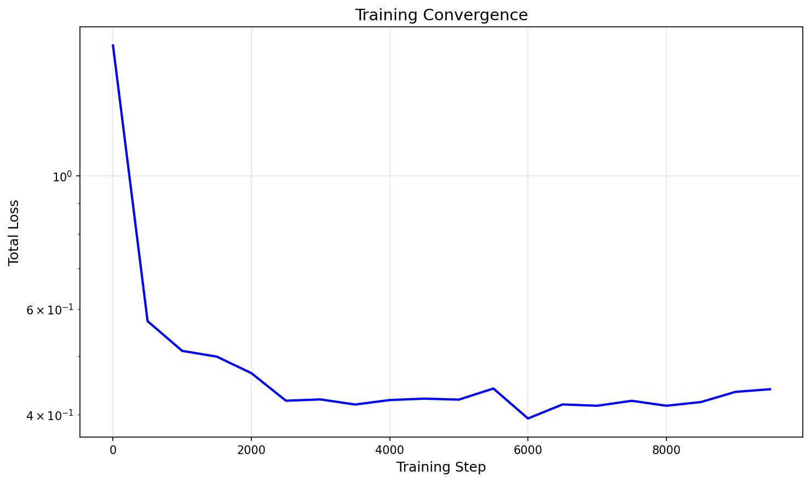
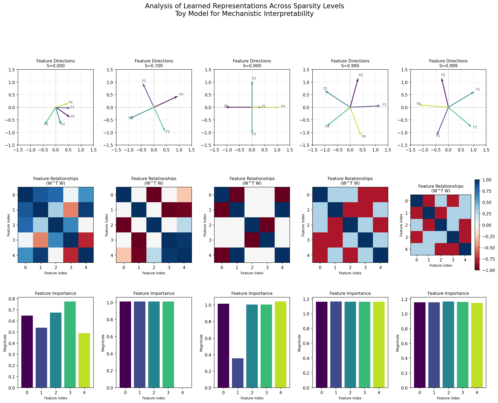

# Sparse Feature Learning for Mechanistic Interpretability

A toy model implementation for studying how neural networks learn and represent features under different sparsity constraints, inspired by [Anthropic's work on mechanistic interpretability](https://www.anthropic.com/research).

## 🎯 Purpose

This repository explores a fundamental question in AI interpretability: **How does sparsity affect what features a neural network learns to represent?**

By training simple autoencoders on synthetic sparse data, we can directly observe:
- Which features the model prioritizes
- How features compete for representation space
- Why sparse representations might be more interpretable

## 🔬 Background: Why This Matters

### The Interpretability Challenge
Modern neural networks, like GPT-4 or Claude, contain billions of parameters and learn complex internal representations. Understanding *what* these models learn and *how* they use that knowledge remains one of the biggest challenges in AI safety and alignment.

### The Sparsity Connection
Research has shown that biological neural networks use sparse coding—only a small fraction of neurons are active at any time. This sparsity appears to make representations more interpretable and robust. Key research includes:

- **Olshausen & Field (1996)**: Showed that sparse coding algorithms learn features resembling those in the visual cortex
- **Electrophysiology studies**: Most neurons fire rarely, but when they do, it's meaningful
- **Energy efficiency**: Brains use ~20 watts; sparse coding saves energy

### The Toy Model Approach
Instead of studying massive models, we use a minimal autoencoder with:
- **5 input features** that we can directly visualize
- **2 hidden units** that force the model to choose which features to represent
- **Controlled sparsity** levels (0% to 99.9%) to study its effects

This simplicity allows us to *see* what the model learns, making it an ideal "microscope" for studying representation learning.

## 🧠 What This Code Does

### Architecture
The model uses a **tied-weight autoencoder**:
- **Encoder**: `h = Wx` (projects input to hidden space)
- **Decoder**: `x̂ = W^T h` (reconstructs from hidden space)
- The same weight matrix `W` is used for both encoding and decoding

This symmetric architecture ensures that the hidden units directly correspond to directions in feature space, making the learned representations interpretable.

### Key Components

#### 1. Sparse Data Generation
```python
# Generate data with controlled sparsity
values = torch.rand(n_instances, batch_size, n_features)
mask = torch.rand(n_instances, batch_size, n_features) > sparsity_levels
sparse_data = values * mask
```

Each "instance" receives data with a different sparsity level, allowing us to compare how sparsity affects learning.

### 2. Parallel Training

Five instances train simultaneously, each with a different sparsity level (0%, 70%, 90%, 99%, 99.9%). This enables direct comparison of learned representations.

### 3. Representation Analysis

After training, we analyze:

- **Feature Directions**: How each feature maps to the 2D hidden space
- **Feature Relationships**: Which features the model treats as similar
- **Feature Importance**: The magnitude of weights for each feature

## Results & Interpretation

### Training Convergence



**What this shows**: The total loss across all instances decreases over 10,000 training steps. The logarithmic scale reveals that the model converges quickly initially, then fine-tunes its representations.

**Key observations**:

- Rapid initial learning (first 1,000 steps)
- Gradual refinement over remaining steps
- Smooth convergence suggests stable training

### Learned Representations Across Sparsity Levels



This figure contains three rows of visualizations for each sparsity level:

#### Row 1: Feature Directions

**What it shows**: Each arrow represents a feature's direction in the 2D hidden space. Longer arrows indicate more important features.

**Key observations**:

- **Low sparsity** (S=0.000): All features get relatively equal representation
- **Moderate sparsity** (S=0.700-0.900): Some features start dominating
- **High sparsity** (S=0.990-0.999): Only the most critical features are strongly represented
- Features pointing in opposite directions are "competing" for representation

#### Row 2: Feature Relationships (Gram Matrix)

**What it shows**: The W^T W matrix shows how similar different features' representations are.

**Color interpretation**:

- **Red (positive)**: Features are represented similarly
- **Blue (negative)**: Features are represented oppositely
- **Near zero**: Features are represented independently

**Key observations**:

- Dense training (S=0) leads to entangled representations
- Sparse training creates more orthogonal (independent) features
- Higher sparsity = cleaner feature separation

#### Row 3: Feature Importance

**What it shows**: Bar charts displaying the magnitude (L2 norm) of each feature's weight vector.

**Key observations**:

- Under dense conditions, all features have similar importance
- As sparsity increases, a few features dominate
- The model naturally learns which features are "worth" representing

## Key Findings & Implications

### 1. Sparsity Forces Feature Selection

As sparsity increases, the model must choose which features are worth representing. This reveals a form of "feature importance" learned purely from data statistics.

**Implication**: Neural networks can automatically discover important features when forced to be selective.

### 2. Competitive Feature Representation

Features compete for the limited representational capacity (2 hidden units). This competition creates interpretable structures—similar features cluster together, while dissimilar features are pushed apart.

**Implication**: Resource constraints drive the emergence of structured, interpretable representations.

### 3. Sparse Representations Are More Interpretable

Higher sparsity levels produce cleaner, more separable feature representations.

**Implication**: Sparsity might be a key ingredient for making neural networks more interpretable. This could inform:

- Architecture design (encouraging sparsity)
- Model auditing (understanding what's learned)
- Why large models sometimes develop interpretable features

### 4. Connection to Biological Systems

The observed behavior mirrors biological neural networks, where sparse coding is prevalent.

**Implication**: Artificial and biological systems may converge on similar solutions for efficient information representation.

## Getting Started

### Prerequisites

- Python 3.8 or higher
- pip

### Installation

```bash
# Clone the repository

# Install dependencies
pip install -r requirements.txt